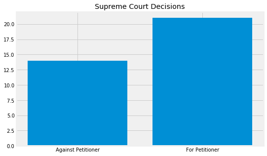
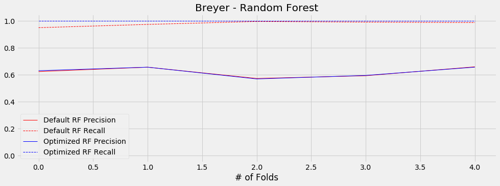
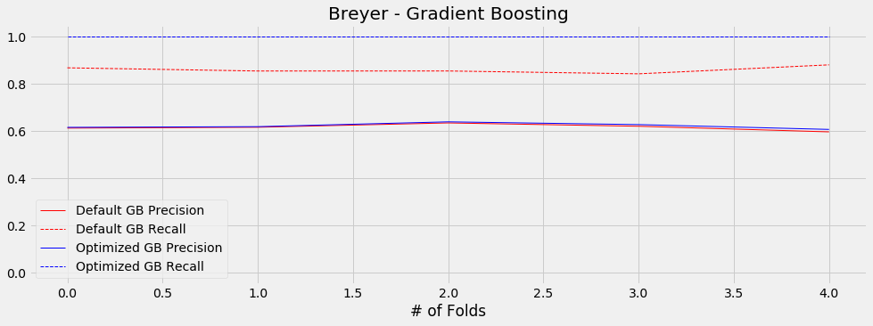

# Predicting Supreme Court Outcomes
Using machine learning to predict the outcomes of Supreme Court cases.

## Why the Supreme Court?
The Supreme Court is the arbiter of law in the United States. Beginning with the opinion of West v. Barnes in 1791, the Court has defended the Constitution and American people for over 200 years. Decisions made in this Court have long-lasting implications that affect hundreds of millions of people. As someone who follows politics and the Court I decided that attempting to predict outcomes of cases would be a good exercise in using NLP while still finding the topic interesting.

## Data Acquisition
__Transcripts__:
    I sourced the transcript data from EricWeiner's [github repository](https://github.com/EricWiener/supreme-court-cases). The data was originally provided by Oyez, an "unofficial online multimedia archive of the Supreme Court of the United States". Each file corresponds to one case formatted in JSON, containing relevant case information (docket, term, decision data, etc...) and the transcript of the oral argument.
    
__Decisions__:
    The Oyez data does not come with the actual decisions each justice makes per case. However, the Washington University School of Law maintains a [database](http://scdb.wustl.edu/data.php) that provides justice-oriented decisions--each row in the table corresponds to one justice's decision per case, including information such as the winning party, whether the justice voted with the majority, and the political direction the justice leaned.
    
## Data Formatting & Cleaning

  

The Oyez data I started with was JSON formatted which is not particularly useful in this case. For each case I extracted relevant case information (docket, term, decision date, etc...) and the transcript of the oral arguments, and inserted it into a CSV file. The transcripts are broken up into portions depending on who is speaking. To start, I decided to make each portion its own row in the CSV. This is the [transcripts_by_justice.csv](https://github.com/rcohngru/Predicting-Supreme-Court-Outcomes/blob/master/data/transcripts_by_justice.csv) file.

I then created CSV files for each justice where each row corresponds to a unique case. I concatenated all of the separate speaking moments for each case, so each row contains a document representing every word the justice spoke during the oral arguments. Conveniently, the Oyez dataset also contains pre-cleaned versions of the transcripts meaning that I do not have to bother with it.

Finally, I joined the justice CSVs with the decisions data from Washington University. Interestingly, the Washington University did not contain explicit data for how each justice voted--rather the data it contained was if the justice voted with the majority, and if the petitioning party won the case. I converted this data into a vote column using the following schema.

|                | 0                                       | 1                                   |
|----------------|-----------------------------------------|-------------------------------------|
| `vote`         | voted against petitioner                    | voted for petitioner            |
| `partyWinning` | no favorable disposition for petitioner | favorable dispostion for petitioner |
| `majority`     | justice dissented                       | justice voted with majority         |

|                 | `partyWinning` == 0 | `partyWinning` == 1 |
|-----------------|---------------------|---------------------|
| `majority` == 0 | `vote` = 1          | `vote` = 0          |
| `majority` == 1 | `vote` = 0          | `vote` = 1          |

The `vote` column is what I will be trying to predict.

## Initial EDA

With all of the data cleaned and formatted in the way that I wanted it to be, I began conducting some basic exploration with it to get a better feel for what it looks like.

  

The longest serving justices have heard the most cases, as is to be expected. Looking at this graph it is apparent that correctly predicting the votes for Justices Gorsuch and Kavanaugh may be be more challening due to lack of data. As the two newest justices--both appointed within the last few years--they have had fewer opportunities to speak.

  

The plot of the total number of words spoken by each Justice is similar to the number of cases, with one notable difference: Clarence Thomas. Thomas is commonly known as the 'Silent Justice' because of how infrequently he speaks during oral arguments. Fun fact: Justice Thomas once went 10 years without asking a single question during a session of the Supreme Court. There is also a smaller amount of data for Justices Gorsuch and Kavanaugh--this too can be attributed to how recently they were nominated to the position.

  

The way each Justice votes is remarkably similar, despite the differences in their political idealogies. Each Justice tends to vote roughly 2/3 of the time in favor of the respondent, although this does not mean they all vote this way at the same time. I am not sure why this is the case--perhaps petitioners are more often the people interested in changing the Constitution and because the Court leans Conservative it is more likely to vote in favor of the respondent.

This also helps establish a baseline for my machine learning models. If I were to always predict a Justice votes in favor of the respondent, I would be correct roughly 2/3 of the time for each Justice.

  

Using data from when Brett Kavanaugh joined the Supreme Court and onward we see that the court as a whole follows the same trend of favoring the respondent about 3/5 of the time. This also helps in establishing a baseline for the ensemble model to predict the outcome of each case. If I were to always predict that the Court votes in favor of the respondent, I would be correct roughly 3/5 of the time for each case.

To avoid redundancy in this README, going forward I will only use Justice Breyer's data to illustrate my process. Having spoken the most words out of any of the other Justices, his data will be the most useful.

## Data Adjustments

The previous graphs tell me that there is a significant imbalance in the class distribution of the data. This is a problem--any model that I use will tend to skew towards the majority class simply because there is more of it. I don't want the *amount* of data to influence a classification, I want the content of the data to be the determining factor in a classification.

  

One method of accounting for a class imbalance in the data is to use **undersampling**. The concept behind undersampling is to randomly exclude some data in the majority class from the training set, so that the class distribution of the data follows an even 50/50 split. The key problem with undnersampling is that you end up with less data overall, which is never ideal.

Another method of accounting for imbalance is to use **oversampling**. Oversampling works in a very similar manner to undersampling, the key difference being that in this case data from the minority class is randomly duplicated to match the number of observations in the majority class. While this helps prevent scarcity of data being a problem as in undersampling, another issue presents itself: the presence of duplicate data in the minority class may improperly influence the model.

**SMOTE** (Synthetic Minority Oversampling Technique), is a method of balancing that seeks to fix the problem with oversampling. Rather than randomly duplicating data in the minority class, SMOTE algorithmically creates synthetic data from the minority class, so that the presence of duplicates does not unduly weight the model.

In the original SMOTE paper, the authors recommended trying a combination of SMOTE and undersampling, so I will try that as well.

  

Clearly, random undersampling is the balancing method to use in this situation. The precision and recall values of the data are consistently higher in this case than when using no balancing, random oversampling, SMOTE, or a combination of SMOTE and random undersampling. Going forward, I will use random undersampling when training my models.

## Modeling

I decided to start my modeling using the `sklearn` default versions of three classification models: Logistic Regression, Random Forests, and Gradient Boosting. Looking at the plot for undersampling it is not immediately obvious which of these models is superior, and none of them of are particularly good anyways.

Let's try and improve the precision and recall scores for these models using some hyperparameter tuning.

  

  

After running a `GridSearchCV` model to find the optimal set of hyperparameters for Random Forests and Gradient Boosting Classifiers with undersampling, it's clear that there is not an improvement between the default `sklearn` model and the optimized one. In fact, the optimized versions actually performed worse than the defaults.

| Model        | Precision | Recall  |
|--------------|-----------|---------|
| Default RF   | 0.32743   | 0.45121 |
| Optimized RF | 0.26016   | 0.39024 |
| Default GB   | 0.3125    | 0.48780 |
| Optimized GB | 0.24778   | 0.34146 |